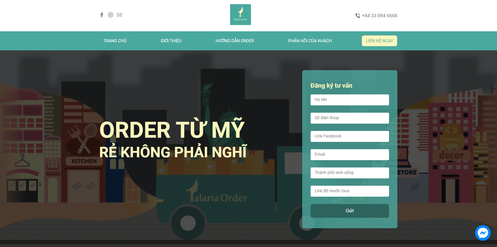
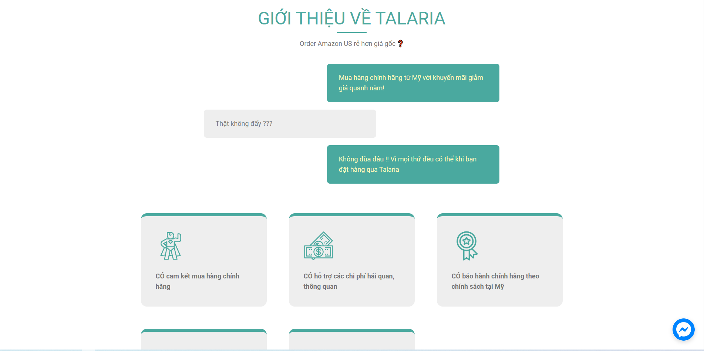
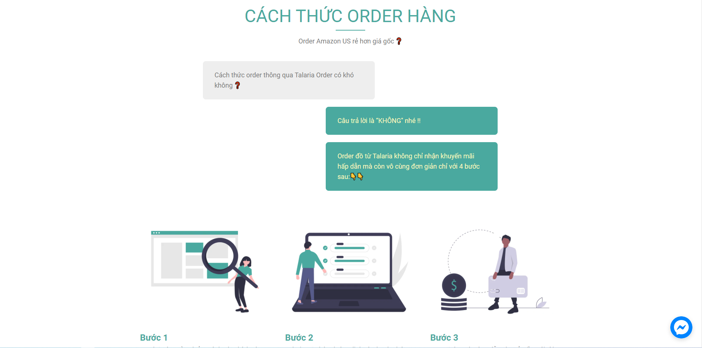

# Talaria Order Landing Page
The landing page I built for my business: Talaria Order

## Project Screen Shot(s)

## Installation and Setup Instructions

Clone down this repository. You will need `node` and `npm` installed globally on your machine.

Installation:

`npm install`

To Start the Application in development mode:

`npm run develop`

To Visit App:

`localhost:8000`

## Technologies:

- Gatsby
- Gatsby Image
- Netlify
- Chakra UI
- GraphQL
- Facebook Messager API
## Reflection
This was the landing page that I spent two days to quickly design and build for my business. The primary goal was to introduce our service, increase brand awareness, and attract more customers to our services.

The most challenging aspect of this project was `time management`. I had to design and develop the website in 2 days, which was an extremely short amount of time. Fortunately, our branding, logos, and cover image was already created before. I quickly did a mock-up with those materials and showed it to the other two co-founders. The whole designing process took half a day, and I did not have to change a lot in the final design. The rest of the time was spent developing using Gatsby.js.